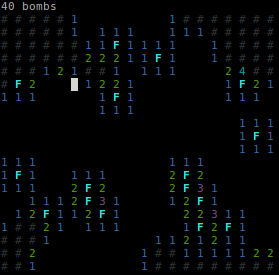
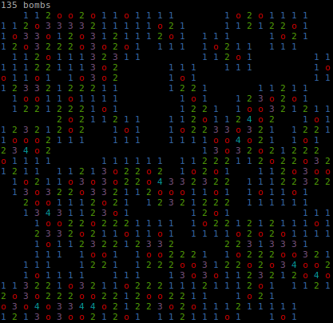

# CLI minesweeper

This project is about developing a minesweeper played with a command line interface.

Usage:
> python3 minesweeper.py [-h] [-s SIZE] [-b BOMBS]

optional arguments | decription
--- | ---
-h, --help              | show this help message and exit
-s SIZE, --size SIZE    | the size of the grid, default: 20, min: 10, max: 50.
-b BOMBS, --bombs BOMBS | the proportion of bombs in the grid, default: 0.15, min: 0.05, max: 0.35

The game is played with VIM controls:
* h: deplace cursor left
* j: deplace cursor down
* k: deplace cursor up
* l: deplace cursor right
* space: reveal a cell, except if there is a flag on
* f: place a flag
* a: reveal all the cells around the selected cell, except where there are flags on

Properties:
* Minimal grid size: 10
* Maximal grid size: 50
* Minimal bomb proportion: 0.05
* Maximal bomb proportion: 0.35

Grid in game:

Grid lost game:

